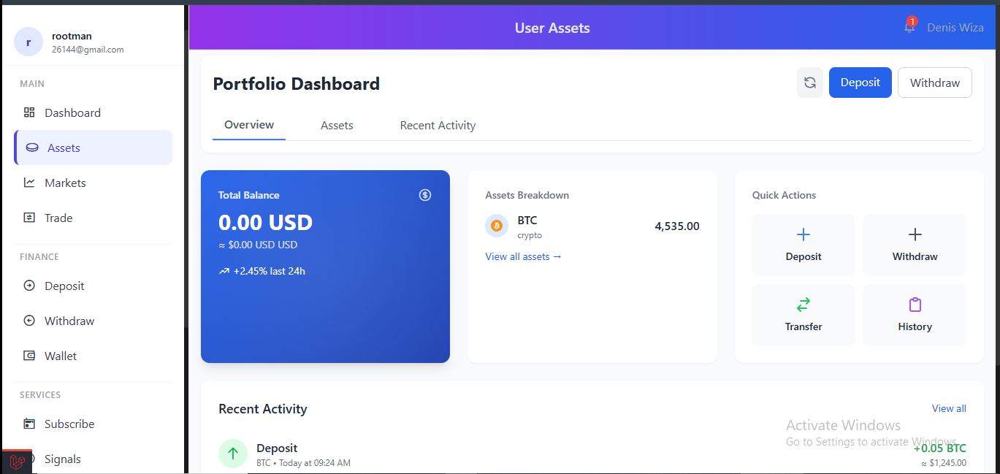

# VoltTraders


A modern, feature-rich trading platform for cryptocurrencies, stocks, and forex markets.

## Screenshot



## Features

- **Market Overview**: Real-time data for cryptocurrencies, stocks, and forex
- **Advanced Trading Interface**: Interactive charts with TradingView integration
- **Multi-Asset Support**: Trade crypto, stocks, and forex in one platform
- **Copy Trading**: Follow and automatically copy trades from expert traders
- **Wallet Management**: Secure wallet system for managing your assets
- **Deposits & Withdrawals**: Easily fund your account or withdraw profits
- **Signals**: Receive professional trading signals and alerts
- **Staking**: Earn passive income by staking supported assets
- **Responsive Design**: Optimized for both desktop and mobile devices

## Installation

### Prerequisites

- PHP 8.0 or higher
- MySQL 5.7 or higher
- Composer
- Node.js and NPM

### Setup

1. Clone the repository
   ```
   git clone https://github.com/ktalib/volttraders.git
   cd volttraders
   ```

2. Install PHP dependencies
   ```
   composer install
   ```

3. Install JavaScript dependencies
   ```
   npm install
   ```

4. Copy the environment file and configure your settings
   ```
   cp .env.example .env
   ```

5. Generate an application key
   ```
   php artisan key:generate
   ```

6. Run database migrations and seed the database
   ```
   php artisan migrate --seed
   ```

7. Build frontend assets
   ```
   npm run dev
   ```

8. Start the server
   ```
   php artisan serve
   ```

## Usage

After installation, you can access the application at http://localhost:8000 or your configured domain.

Use the following credentials for demo access:
- Email: demo@volttraders.com
- Password: password

## Technologies Used

- **Backend**: Laravel PHP Framework
- **Frontend**: Blade, Alpine.js, Tailwind CSS
- **Database**: MySQL
- **Charts**: TradingView
- **APIs**: CoinGecko, third-party market data providers

## License

[MIT License](./LICENSE)

## Security

If you discover any security related issues, please text me at +2347039586723 instead of using the issue tracker.
